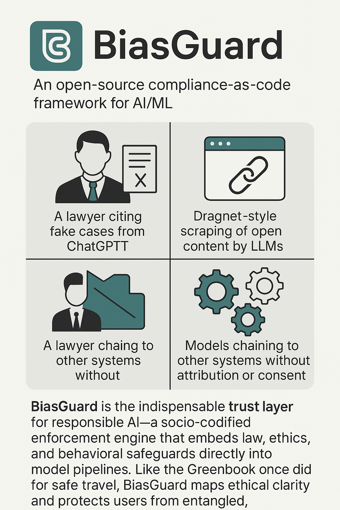
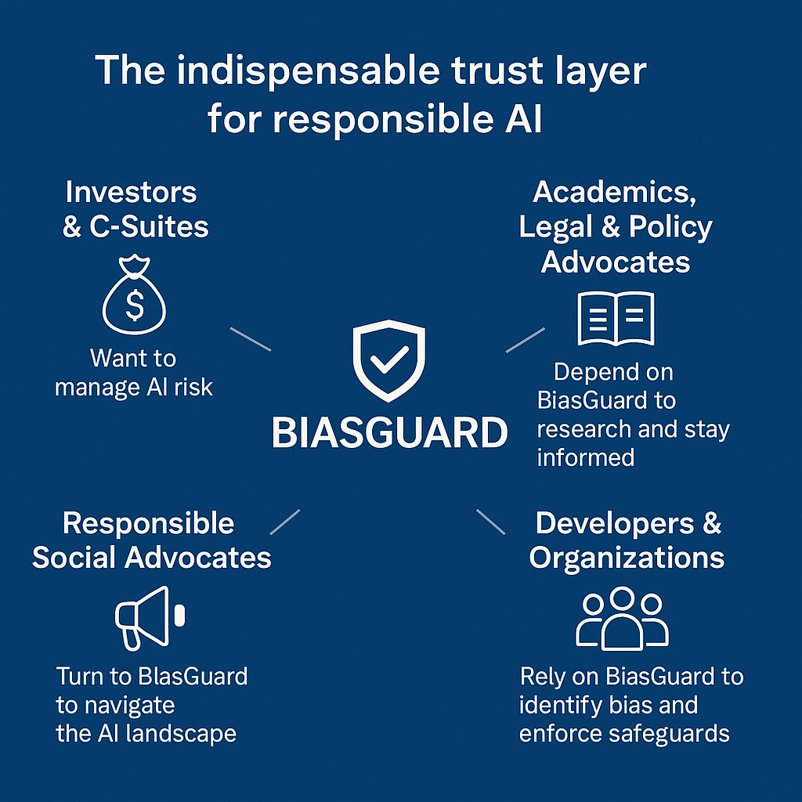
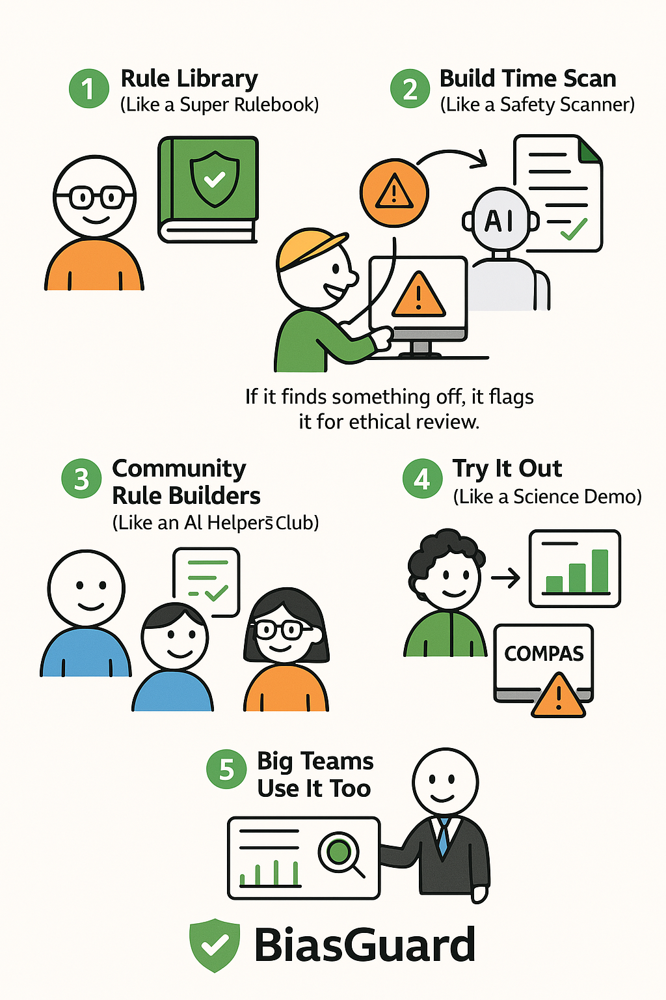
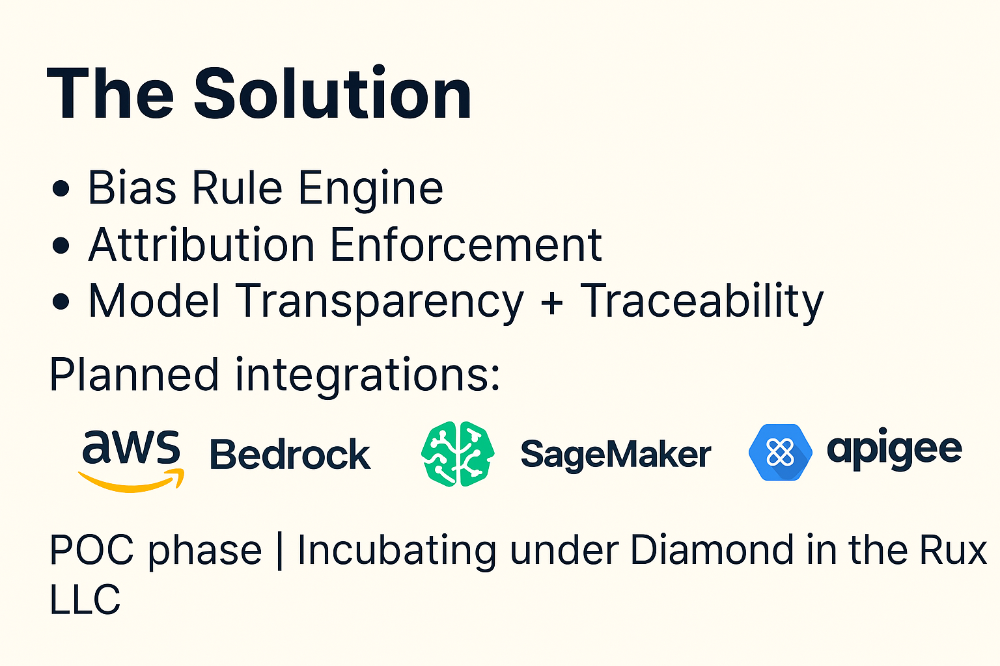
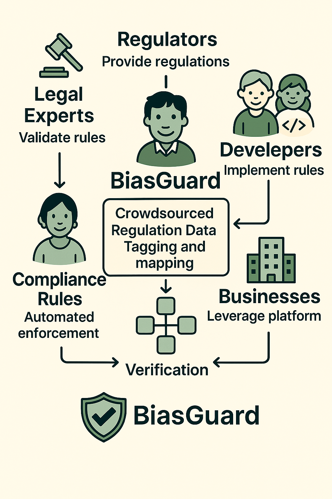
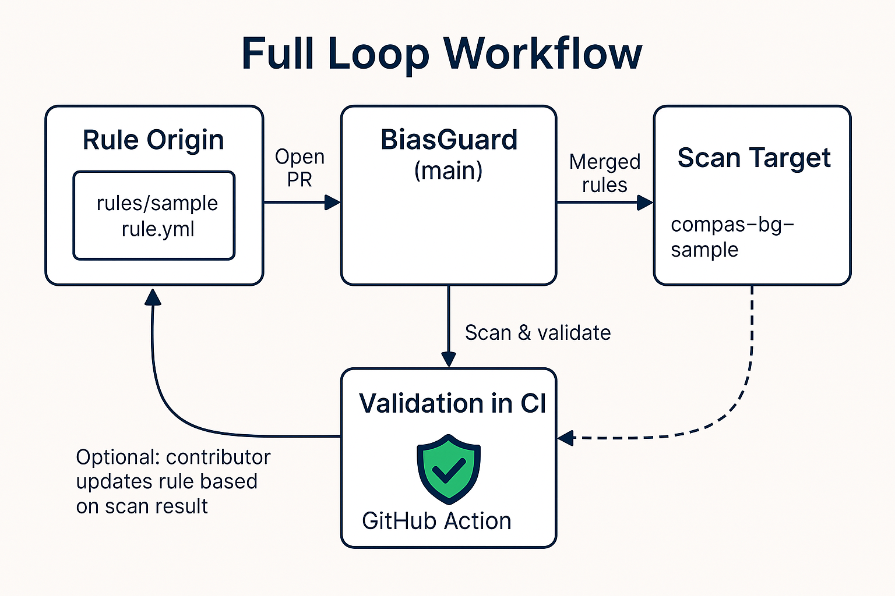
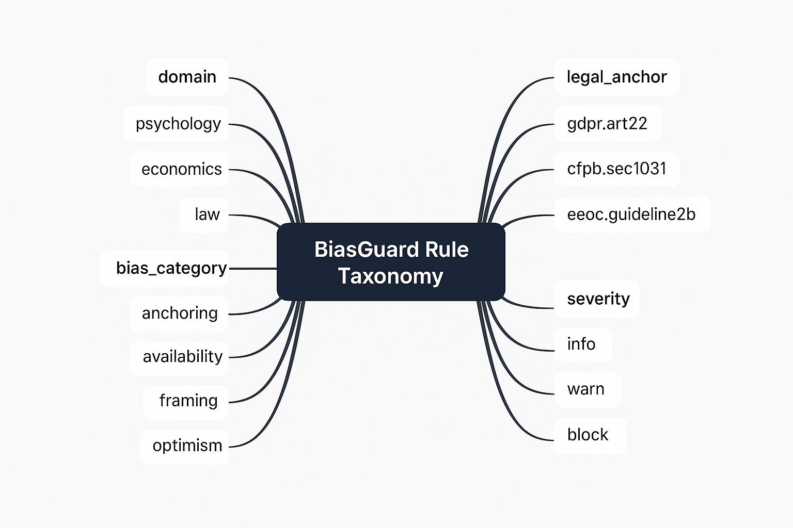

# 🛡️ BiasGuard: The Indispensable Trust Layer for Responsible AI

**BiasGuard** is an AI policy enforcement framework built to make AI systems accountable, auditable, and aligned with ethical and legal standards from the start. By integrating directly into AI/ML pipelines, BiasGuard provides codified bias prevention, transparency, and compliance through an open-core rule engine.

> Inspired by tools like CloudFormation Guard and OPA  
> Powered by rule-based enforcement and CI/CD integration  
> Designed for developers, researchers, auditors, legal advocates, and social impact professionals

---

## ⚠️ Why We Need BiasGuard

AI systems are becoming more powerful — and more unpredictable.

- 🧑‍⚖️ A lawyer citing fake cases from ChatGPT  
- 🌐 Dragnet-style scraping of public content by LLMs  
- 🤖 Models chaining to external systems, without attribution or oversight

**BiasGuard is our answer.**  
A socio-codified trust layer that embeds behavioral safeguards, legal clauses, and ethical governance directly into model pipelines — before harm occurs.

---

## 🤖 What Is BiasGuard?

**Explain Like I'm 6:**  
BiasGuard is like a superhero for AI — it helps catch and prevent bias before it causes problems!

---

## 🔌 How It Integrates

BiasGuard integrates directly into CI/CD pipelines and supports API-driven connections to platforms like AWS Bedrock, SageMaker, and Apigee.

Policy enforcement becomes automated and continuous — helping teams build safer systems with real-time rule validation.

---

## 🌍 Who Relies on BiasGuard?

BiasGuard serves the broader ecosystem of responsible AI builders and defenders:

| Stakeholder Group | How BG Helps |
|-------------------|--------------|
| 🔧 **Developers** | Codify fairness, validate AI behavior, block unsafe outputs |
| 📊 **Executives & Investors** | Identify risk exposure, reduce liability, validate ethics claims |
| ⚖️ **Academics, Legal & Policy Advocates** | Translate evolving laws into enforceable code |
| 🌱 **Social & DEIA Advocates** | Protect communities at risk from unaccountable models |
| 🧠 **Researchers & Audit Partners** | Experiment with transparent, clause-aware model governance |

---

## 🔄 CI/CD Workflow

The BiasGuard contributor flow and enforcement lifecycle is streamlined using GitHub Actions and validation automation.

### ✅ Contributor Loop

- **Rule Submission** — New YAML rules submitted via Pull Requests  
- **Validation** — Automated checks confirm structure, tags, and references  
- **Enforcement** — Approved rules deploy and run in CI/CD pipelines  

---

## 📚 Rule Taxonomy

Rules are organized by domain (e.g., housing, hiring, education) and mapped to relevant clauses or behavioral risks.

This structure ensures that rules are traceable, scalable, and enforceable across model types and use cases.

---

## 🙌 Get Involved

- 📬 Contact: [m.ruxsaksriskul@gmail.com](mailto:m.ruxsaksriskul@gmail.com)  
- 🌐 Visit: [biasguard.h0stname.net](http://biasguard.h0stname.net)  
- 💡 Star / Fork / Watch: [GitHub Repo](https://github.com/mruxsaksriskul/biasguard)  
- 🤝 Contribute: Submit a rule, share a use case, or help us map legal frameworks

---

*This README is part of BiasGuard's open-source initiative and serves as a comprehensive guide to our mission, workflows, and integration points.*

© 2025 Diamond in the Rux LLC – All Rights Reserved  
BiasGuard™ is a project built for public impact, incubated under a responsible open-core model.
